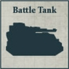

### Autokratorii Regiment

**Cortex Controller:** One Vehicle model from a Compulsory Detachment may be upgraded with the [Cortex Controller] special rule for +10 points.

**COMPULSORY DETACHMENTS**

  

**EXPANDED DETACHMENTS**

      

**One of the following:**

**OR** 

 

---

## Legio Cybernetica Cohort

**Legio Cybernetica:** All slots within this Formation, apart from Core, Transport, and Titan slots, must be filled with Detachments that have either the [Cortex Controller] or [Cybernetica Cortex] (X) special rule. The range of Cortex Controller's effects for all models within the Formation is 12" instead of 8".

**COMPULSORY DETACHMENTS**

 
 

**EXPANDED DETACHMENTS**

       

**One of the following:**

  

**OR** 

 

---

## Taghma Sub-covenant

**Dedicated Transports:** Detachments within the Formation that contain only Infantry or Walker models may be upgraded with Triaros Armoured Conveyors as Dedicated Transports.

**COMPULSORY DETACHMENTS**

    

**EXPANDED DETACHMENTS**

      

**One of the following:**

**OR**

 

---

## Ordo Reductor Subdivision

**COMPULSORY DETACHMENTS**

   

**EXPANDED DETACHMENTS**

    

**One of the following:**

**OR** 

