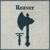
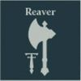
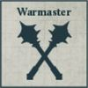

## Axiom Battleline Maniple

**COMPULSORY DETACHMENTS**

  

**OPTIONAL DETACHMENTS**

  

---

## Lupercal Light Maniple

**COMPULSORY DETACHMENTS**

 

**OPTIONAL DETACHMENTS**

  

---

## Purgiatus Heavy Maniple

**COMPULSORY DETACHMENTS**

**OPTIONAL DETACHMENTS**

   

---

## Ruptura Battleline Maniple

**COMPULSORY DETACHMENTS**

 

**OPTIONAL DETACHMENTS**

   

---

## Ferrox Light Maniple

**COMPULSORY DETACHMENTS**

 

**OPTIONAL DETACHMENTS**

  

---

## Corsair Battleline Maniple

**COMPULSORY DETACHMENTS**

 

**OPTIONAL DETACHMENTS**

   
