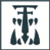
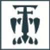
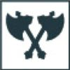
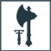
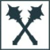

Myriad were the hosts of the Mechanicum who swore their allegiance the Great Crusade, from the bellicose Myrmidon cults to the cybernetic flesh-constructs of the Lacrymal. Mightiest of them all, however, were the god- engines of the Collegia Titanica, a singular martial class within, and simultaneously quite distinct from, the ranks of the Cult Mechanicus.

The towering bipedal god-engines known as 'titans' have served the Tech-Priests of Mars since the time referred to only as the Era of Pathogenesis. Though little data survives, it is known that titans first appeared during a great and terrible war fought between the besieged forges of the nascent Mechanicum and a debased caste of cabalistic heretics named the Cy-Carnivora. Vast swathes of the blasted red wastes of Mars had fallen to the Cy-Carnivora Mekwrights, and it took the creation of three entire Legios of what would become the Collegia Titanica to defeat them. These three Legios were collectively named the 'Triad Ferrum Morgulus', and it was from the template of their creation that all future Titan Legions were founded.

Created to defeat the monstrous hunger-engines of the Cy-Carnivora, little could stand before a titan, and nothing before an entire Legios, which at its height might number between 200-300 towering machines of destruction. Having finally driven the horrors of Old Night from Mars, the Titan Legios were frequently fielded in the service of one forge against another in a series of internecine civil wars and schisms, seeding enmities that would bear bitter fruit indeed in the dark age to come. When the Emperor came to Mars and the accords were sworn at Olympus Mons, the Titan Legios were turned to the service of the Great Crusade, where their devastating weaponry, impregnable armour and the peerless skill and devotion of their crews proved every bit as destructive against recalcitrant empires and xenos horrors as they had against the Cy-Carnivora.

By the height of the Great Crusade, scores of Titan Legios marched to war, each one a hammer the Imperium unleashed when a foe was deemed unworthy of quarter. The Collegia Titanica on Mars served as overall repository for the martial traditions and templates of the Legios, though in reality each was in effect its own master. By the auspices of the Collegia Titanica, each Legio assumed its own title, including High Gothic and Low Gothic monikers, icons, banners, colours and other unique elements of heraldry. When the Warmaster dragged the Imperium into civil war, the Collegia Titanica was not spared disunity.

Across the galaxy, Titan Legion turned upon Titan Legion, and the galaxy quaked beneath their tread. Innumerable worlds were burned to ash beneath the wrath of warring god-engines and by war's end entire Legios had been rendered extinct, the loyal enshrined forever as heroes, the disloyal struck from the records to fade from memory.

The following section presents the Collegia Titanica Army List, representing a Titan Legion deploying a demi-Legio or greater strength of titans to the battlefield, supported by Knight Banners. Within you'll find all the rules needed to build a Collegia Titanica Army.

**Designer's Note: Collegia Titanica Army List**

The Collegia Titanica Army List presented over the following pages is intended as a thematic alternative Primary Army List. In Matched Play missions, they suffer from a lack of Objective control - with a Tactical Strength of 0, Titans cannot capture or contest Objectives - which makes achieving a conventional victory difficult. Allied Contingents mitigate this disadvantage to a degree and an Army of Titans and Knights is a destructive force, but the enemy will have a much easier time seizing and holding Objectives, making Victory Points easier to come by for them.

The Collegia Titanica Army List includes the Detachments listed below, which are taken from the Strategic Assets List (see page 198 of the *Legions Imperialis Rulebook*). These count as part of the Primary Army List and so do not contribute to the Allied Contingent points total.

-   Dire Wolf Heavy Scout Titan

-   Warhound Hunting Pack

-   Reaver Battle Titan

-   Warbringer Nemesis Titan

-   Warlord Battle Titan

-   Warmaster Heavy Battle Titan

-   Warmaster Iconoclast Titan

-   Questoris Knight Banner

-   Cerastus Knight Banner

-   Acastus Knight Banner

**Individual Detachment Roles**

Each Titan Detachment is also assigned a specific battlefield role for
the purpose of building a Collegia Titanica Army. They still fill the Titan Detachment role as well.

Collegia Titanica Formations cannot be taken as Allied Contingents.

**Dire Wolf Heavy Scout Titan**

**Warhound Hunting Pack**

**Warlord Battle Titan**

**Reaver Battle Titan**

**Warbringer Nemesis Titan**

**Warmaster Heavy Battle Titan and Warmaster Iconoclast Titan**