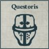
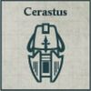
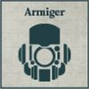

## Barony Guard Lance

**Seneschal:** After this Formation is deployed, or after all deployment is finished if the Formation is deployed in Reserve, choose one model that is part of a Compulsory Detachment to be upgraded to a Baron for free. A model upgraded in this way increases its CAF by +2 and its Wounds characteristic by 1.

**COMPULSORY DETACHMENTS**

  

**OPTIONAL DETACHMENTS**

   

---

## Vanguard Lance

**The Household's Spear:** All Detachments within this Formation gain the [Forward Deployment] special rule.

**COMPULSORY DETACHMENTS**

  

**OPTIONAL DETACHMENTS**

   

---

## Bastion Lance

**COMPULSORY DETACHMENTS**

  

**OPTIONAL DETACHMENTS**

  

---

## Bonded Household Lance

**Favoured by the Omnissiah:** All Questoris Knights in this Formation must have the Knight Styrix or Knight Magaera weapon loadout. All Armiger slots must be filled with Mechanicum Knight Moirax Talons.

**COMPULSORY DETACHMENTS**

 

**OPTIONAL DETACHMENTS**

    
