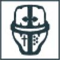

Rarely was a Knightly Household mustered in great numbers, operating instead primarily as small groups of questing knights that served as supporting elements of the Great Crusade. Smaller and lighter than the god-machines of the Collegia Titanica, knights were nonetheless mighty creations of the Omnissiah. A single knight was capable of delivering enough firepower to annihilate an infantry platoon in an instant, and possessed of sufficient might, speed and skill at arms to bring down larger foes unaided. Each one was piloted by a noble warrior, a veteran of many campaigns and skilled in the arts of war. Rare was it for more than a handful of knights from the same Household to be deployed to a single theatre of war, and by the later years of the Great Crusade many a House had scions scattered across dozens of fleets, returning home after years, or even decades, replete with tales of honour and glory.

During the terrible wars of the Horus Heresy, it became far more commonplace for a Household to march to war arrayed in full, the very earth trembling beneath the march of serried engines. When the Warmaster rebelled, many Knightly Houses rallied to his banner even as others drew their ranks tight in defence of their Emperor and his hard-won domain. For a Knight Scion, an enemy Household was the ultimate foe, a true test of might and skill that would earn the victor great honours;

the Horus Heresy was the crucible in which the greatest of Households would emerge triumphant. As before, Knight Banners marched in step with the Legiones Astartes and Imperial Army, or assumed the mantle of Freeblade in search of personal honour, while other Households recalled their scions home. As one, such Knight Houses would often operate as independent forces, possessing the strength to challenge even the might of the god-engines of the Collegia Titanica.

Amassed in number, a Household marched with tremendous fanfare of blaring warhorns and bright heraldry. In battle, massed firepower was employed from numerous vectors, relying upon the speed and power of the knight amours to overwhelm even the might of the god-engines of the Collegia Titanica.

Questoris knights formed the core of a Household force, marching into the guns of the enemy with ion shields raised. Acastus knights unleashed volleys to break open fortified positions and obliterate armoured columns, while fast-moving banners of Cerastus armours swept down upon the foes' flanks. Such a force was one of total destruction, descending upon the enemy with murderous purpose, devoid of mercy. When the battle was won, the Household would march on, scouring the planet clean of any who would oppose them before taking to the stars once more, a blade to carve through the heavens.

The following section presents the Knight Household Army List, representing a Household arrayed for war in significant numbers. Within you'll find all the rules needed to build a Knight Household Army, including additional rules for Armigers when fielded as part of this list.

**Designer's Note: Knight Household Army List**

The Knight Household Army List presented over the following pages is intended as a thematic alternative Primary Army List. In Matched Play missions, they suffer from a lack of Objective control - with low Tactical Strength with which to capture or contest Objectives - which makes achieving a conventional victory difficult. Allied Contingents and list-specific special rules benefiting Armigers mitigate this disadvantage to a degree, but the enemy will have a much easier time seizing and holding Objectives, making Victory Points easier to come by for them.

The Knight Household Army List includes the Detachments listed below, which are taken from the Strategic Assets List (see page 198 of the *Legions Imperialis Rulebook*). These count as part of the Primary Army List and so do not contribute to the Allied Contingent points total.

* Questoris Knight Banner

* Cerastus Knight Banner

* Acastus Knight Banner

In addition, the Questoris Knight Armiger Talon and Mechanicum Knight Moirax Talon Detachment upgrades are not available to Detachments chosen as part of this list. Instead, the following new Detachments are available to a Knight Household List

* Questoris Knight Armiger Talon - 180 points

* Mechanicum Knight Moirax Talon - 200 points

These Detachments use the profile for the respective upgrades, with a Detachment size of 3. Each Detachment can purchase up to two upgrades to their Detachment size, with each upgrade increasing the Detachment size by 3. A Questoris Knight Armiger Talon upgrade costs 160 points, and a Mechanicum Knight Moirax Talon upgrade costs 180 points.

**Knight Retainers:** Knight Armiger and Knight Moirax models within a Knight Household Formation have a Tactical Strength of 3 instead of 1.

**Detachment Roles**

Each Knight Household Detachment is also assigned a specific battlefield role for the purpose of building a Knight Household Army. They still fill the Knight Detachment role as well.

Knight Household Formations cannot be taken as Allied Contingents.

 **Questoris Knight Banner**

 **Cerastus Knight Banner**

 **Acastus Knight Banner**

 **Armiger Knight Banner**