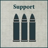
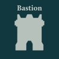

## Itinerant Cybernetica Cohort

**SUPPORT FORMATION: MECHANICUM TAGHMATA**

**Order Cascade:** Whenever a Detachment in this Support Formation is activated, the controlling player may choose another friendly Detachment from this Support Formation within 6" of the activated Detachment that has already revealed its Order this round. The activated Detachment may discard its Order token and replace it with a new Order chosen from those shown in the [Cybernetica Cortex] (X) special rule of the chosen friendly Detachment.

All Detachments included in this Support Formation must have the [Cybernetica Cortex] (X) special rule. Detachments within this Support Formation cannot benefit from the [Cortex Controller] special rule – they cannot be issued Orders other than those from their variant of the [Cybernetica Cortex] (X) special rule or another variant through the Order Cascade special rule.

**COMPULSORY DETACHMENTS**

  

**OR**

  

**OPTIONAL DETACHMENTS**

   

---

## Brethren of Iron

**SUPPORT FORMATION: LEGIONES ASTARTES**

**Forge Lord:** HQ Detachment slots in this Support Formation must be filled by HQ Detachments chosen from the Legiones Astartes Army List.

Support, Vanguard and Bastion Detachment slots in this Support Formation must be filled with Detachments from the Mechanicum Taghmata Army List. Detachments taken from the Mechanicum Taghmata Army List in this way must have the [Cybernetica Cortex] (X) special rule.

Core Detachment slots in this Support Formation may be filled by Core Detachments chosen from the Legiones Astartes Army List or with Thallax Cohort Detachments chosen from the Mechanicum Taghmata Army List. HQ and Core Detachments chosen from the Legiones Astartes Army List in this Support Formation gain the [Cortex Controller] special rule.

Detachments from the Mechanicum Taghmata Army List in this Support Formation do not gain the Legiones Astartes special rule selected for this Support Formation, but instead gain the [Line] special rule while that Detachment is within 8" of a Legiones Astartes Detachment from the same Support Formation.

**COMPULSORY DETACHMENTS**

  

**OPTIONAL DETACHMENTS**

   

**One of the following:**

**OR**

 

---

## Collegia Titanica Support Cohorts

**SUPPORT FORMATION: COLLEGIA TITANICA**

**Bound Taghma:** All slots within this Support Formation, apart from Titan Detachment slots, must be filled by Detachments taken from the Mechanicum Taghmata Army List. Non-Core Detachments taken from the Mechanicum Taghmata Army List must have the [Cybernetica Cortex] (X) special rule.

All Titan Detachments within this Support Formation gain the [Cortex Controller] special rule. A Titan model from this Support Formation counts its Tactical Strength as equal to its remaining Wounds while within 3" of a non-Titan Detachment from this Support Formation.

**COMPULSORY DETACHMENTS**

  

**OPTIONAL DETACHMENTS**

   

**One of the following:**

 

**OR**

 

---

## Knight Household Retainer Cohorts

**A Knight Household tightly bound to a Forge World would often rely upon Taghma elements to support its scions on the battlefield.** A common practice was the induction of faster automata such as Vorax and Vultarax into Knight Lances, where the automata would serve as pathfinder and vanguard elements in concert with Knight Armigers.

**SUPPORT FORMATION: KNIGHT HOUSEHOLD**

**Household Vanguard**: All Vanguard Detachment slots within this Support Formation must be filled by Detachments taken from the Mechanicum Taghmata Army List. Detachments taken from the Mechanicum Taghmata Army List must have the [Cybernetica Cortex] (X) special rule.

- Knight Detachments in this Support Formation gain special rules depending on the Compulsory Detachments chosen:

- If all Compulsory Vanguard Detachment slots are filled with Vorax Battle-automata Maniple Detachments, then all Knight Detachments in this Support Formation gain the [Forward Deployment] special rule.

- If all Compulsory Vanguard Detachment slots are filled with Vultarax Stratos-automata Squadron Detachments, then all Knight Detachments in this Support Formation gain the [Outflank] special rule.

Questoris Knight Armiger Talons and Mechanicum Knight Moirax Talons cannot be taken as Detachment Upgrades for Detachments taken in Knight Detachment slots; they may only be selected to fill Armiger Knight Banner slots.

All Questoris Knight Banner and Cerastus Knight Banner Detachments within this Support Formation gain the [Cortex Controller] special rule.

**COMPULSORY DETACHMENTS**

  

**OPTIONAL DETACHMENTS**

      

---

## Knight Household Aegis Cohorts

**SUPPORT FORMATION: KNIGHT HOUSEHOLD**

**Inducted Automata:** All slots within this Support Formation, apart from Knight Detachment slots, must be filled by Detachments taken from the Mechanicum Taghmata Army List. Detachments taken from the Mechanicum Taghmata Army List must have the [Cybernetica Cortex] (X) special rule.

All Knight Detachments within this Support Formation gain the [Cortex Controller] special rule. Questoris Knight Armiger Talons and Mechanicum Knight Moirax Talons cannot be taken as Detachment Upgrades for Detachments taken in Knight Detachment slots.

**COMPULSORY DETACHMENTS**

  

**OPTIONAL DETACHMENTS**

    

---

## Ironbound Ruinhost

**SUPPORT FORMATION: DARK MECHANICUM**

**Automata Malefica:** All slots within this Support Formation must be filled by Detachments taken from the Mechanicum Taghmata Army List. Detachments taken from the Mechanicum Taghmata Army List must have the [Cybernetica Cortex] (X) special rule.

All Detachments included in this Support Formation with the [Cybernetica Cortex] (X) special rule replace the variant they have with [Cybernetica Cortex] (March, Charge) and have the [Dread Aura] (3") special rule.

**COMPULSORY DETACHMENTS**

  

**OPTIONAL DETACHMENTS**

   

**One of the following:**

 

**OR**

 

---

## Iron Cohort

**SUPPORT FORMATION: SOLAR AUXILIA**

**Master of Automata:** HQ Detachment slots in this Support Formation must be filled by HQ Detachments chosen from the Solar Auxilia Army List. HQ Detachments chosen from the Solar Auxilia Army List in this Support Formation gain the [Cortex Controller] special rule.

Optional Support, Vanguard and Bastion Detachment slots in this Support Formation must be filled with Detachments from the Mechanicum Taghmata Army List. Detachments taken from the Mechanicum Taghmata Army List in this way must have the [Cybernetica Cortex] (X) special rule.

Core Detachment slots in this Support Formation may be filled by Core Detachments chosen from the Solar Auxilia Army List or with Thallax Cohort Detachments chosen from the Mechanicum Taghmata Army List.

**COMPULSORY DETACHMENTS**

   

**OPTIONAL DETACHMENTS**

   

**One of the following:**

 

**OR**

 

---

