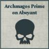
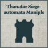

## Demi-Maniple Aeterna

**Defenders of Magma City:** This Formation can only be included in an Army with the Loyalist Allegiance.

**Children of the Storm:** Once per game, when a Titan from this Formation finishes its activation during the Combat phase, it may immediately fire one of its weapons again.

**STANDARD DETACHMENTS: 955 Points**

  

* **Reaver Battle Titan**

1 Reaver Battle Titan equipped with Reaver volcano cannon, Reaver gatling blaster, and Reaver Vulcan mega-bolter.

* **Questoris Knight Banner**

1 Knight Errant and 1 Knight Gallant, both equipped with rocket pods.

* **Krios Venator Squadron**

6 Krios Venators.

**EXPANDED DETACHMENTS: 1,165 Points**

  

* **Warhound Hunting Pack**

1 Warhound Titan equipped with plasma blastgun and vulcan mega-bolter.

1 Warhound Titan equipped with volkite eradicator and vulcan mega-bolter.

* **Cerastus Knight Banner**

2 Knight Lancers.

* **Vultarax Stratos-automata Squadron**

4 Vultarax.

---

## Exsomnis-Tertia Cybernetica Cohort

**Defenders of Magma City:** This Formation can only be included in an Army with the Loyalist Allegiance.

**Adaptive Protocols:** When a Detachment from this Formation that has the [Cybernetica Cortex] (X) special rule is activated, its Order may be replaced with a new Order. The new Order must be the same Order as one issued to a friendly Detachment from this Formation that has the [Cybernetica Cortex] (X) special rule and is within 6" of the activated Detachment.

The new Order can be an Order other than those shown in the activated Detachment's [Cybernetica Cortex] (X) special rule, even if the activated Detachment is not within range of a Cyber Controller.

**COMPULSORY DETACHMENTS: 680 Points**

    

* **Archmagos Prime on Abeyant**

1 Archmagos on Abeyant.

* **Domitar Battle-automata Maniple**

3 Domitar.

* **Castellax Battle-automata Maniple**

6 Castellax.

* **Castellax Battle-automata Maniple**

6 Castellax.

* **Vorax Battle-automata Maniple**

4 Vorax.

**OPTIONAL DETACHMENTS: 890 Points**

       

* **Tech-Priest Auxilia**

3 Tech-Priest Auxilia Detachments.*

* **Castellax Battle-automata Maniple**

6 Castellax.

* **Castellax Battle-automata Maniple**

6 Castellax.

* **Domitar Battle-automata Maniple**

3 Domitar.

* **Vorax Battle-automata Maniple**

4 Vorax.

* **Thanatar Siege-automata Maniple**

4 Thanatar equipped with plasma mortars and mauler bolt cannon.

*As per the [Tech-Priest Auxilia] special rule, this is three separate Detachments of Tech-Priest Auxilia consisting of a single model, which occupy the same slot.

---

## Sibilians Taghma

**Servants of Kelbor-Hal:** This Formation can only be included in an Army with the Traitor Allegiance.

**Protocol - Scourge:** While a Detachment from this Formation with the [Networked Anima] special rule is within 8" of a model with the [Noosphere Controller] special rule from this Formation, all models in that Detachment increase the range of their weapons by 4".

**COMPULSORY DETACHMENTS: 944 Points**

    

* **Scintillax 'Cyclops' Noospheric Stalker Network**

4 Scintillax equipped with storm lasers.

* **Adsecularis Tech-thrall Covenant**

8 Tech-thralls.

* **Adsecularis Tech-thrall Covenant**

8 Tech-thralls.

* **Serperos 'Overlord' Heavy Stalker Maniple**

6 Serperos equipped with exo-planar bombards and irad-scourgers.

* **Myrmidon Secutor Host**

6 Myrmidon Secutors. This Detachment has 2 Triaros as Dedicated Transports.

**EXPANDED DETACHMENTS: 727 Points**

   

* **Adsecularis Tech-thrall Covenant**

8 Tech-thralls.

* **Myrmidon Secutor Host**

6 Myrmidon Secutors. This Detachment has 2 Triaros as Dedicated Transports.

* **Myrmidon Secutor Host**

6 Myrmidon Secutors. This Detachment has 2 Triaros as Dedicated Transports.

* **Serperos 'Overlord' Heavy Stalker Maniple**

6 Serperos equipped with exo-planar bombards and irad-scourgers.
