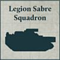
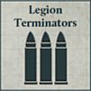

## Iron Hands Seeker-Killer Clave Ultor

**Sons of Ferrus Manus:** This Formation must be from the [Iron Hands Legion](../the_legiones_astartes/legiones_astartes_special_rules.md#the-xth-legion-iron-hands) and can only be included in an Army with the Loyalist Allegiance.

**Seeker-killers:** Detachments from this Formation have the [Macro-extinction Targeting Protocols] special rule.

**STANDARD DETACHMENTS: 450 Points**

   

* **Legion Sicaran Squadron**

4 Legion Sicarans, equipped with twin-linked accelerator autocannon and Sponson Mounted lascannon.

* **Legion Sicaran Squadron**

4 Legion Sicarans, equipped with Omega plasma array and Sponson Mounted lascannon.

* **Legion Sabre Squadron**

4 Sabres, equipped with Hull Mounted neutron blaster and Hull Mounted multi-melta.

**EXPANDED DETACHMENTS: +270 Points**

 

* **Legion Sicaran Squadron**

4 Legion Sicarans, equipped with twin-linked accelerator autocannon and Sponson Mounted lascannon.

* **Legion Sabre Squadron**

4 Sabres, equipped with Hull Mounted neutron blaster and Hull Mounted multi-melta.

---

## Iron Warriors Proioxis Macro-Assault Wing

**Sons of Perturabo:** This Formation must be from the [Iron Warriors Legion](../the_legiones_astartes/legiones_astartes_special_rules.md#the-ivth-legion-iron-warriors) and can only be included in an Army with the Traitor Allegiance.

**Hammerblow Assault:** Legion Terminator models from this Formation increase their CAF by 2 during any round in which they Disembarked from a Spartan model from this Formation.

**STANDARD DETACHMENTS: 400 Points**

 

* **Legion Terminator Detachment**

4 Legion Terminator models. This detachment has 2 Spartans as Dedicated Transports. These have Sponson Mounted quad lascannon and Hull Mounted lascannon.

* **Legion Terminator Detachment**

4 Legion Terminator models. This detachment has 2 Spartans as Dedicated Transports. These have Sponson Mounted quad lascannon and Hull Mounted lascannon.

**EXPANDED DETACHMENTS: +400 Points**

 

* **Legion Terminator Detachment**

4 Legion Terminator models. This detachment has 2 Spartans as Dedicated Transports. These have Sponson Mounted quad lascannon and Hull Mounted lascannon.

* **Legion Kratos Squadron**

3 Legion Kratos, equipped with Kratos battlecannon, Kratos lascannon, and Sponson Mounted lascannon.

---

## Alpha Legion Harrow Group Arcadus

**Protean Instrument:** This Formation must be from the [Alpha Legion](../the_legiones_astartes/legiones_astartes_special_rules.md#the-xxth-legion-alpha-legion).

**Obfuscation Protocols:** Detachments from this Formation have the [Outflank] and [Scout] special rules.

**STANDARD DETACHMENTS: 630 Points**

  

* **Legion Sicaran Punisher Squadron**

4 Sicaran Punishers, equipped with Sponson Mounted heavy bolters.

* **Legion Sicaran Punisher Squadron**

4 Sicaran Punishers, equipped with Sponson Mounted heavy bolters.

* **Legion Plasma Gun Support Detachment**

8 Support Legionaries models. This Detachment has 4 Land Raiders as Dedicated Transports. One model has a Pintle Mounted multi-melta.

**EXPANDED DETACHMENTS: +300 Points**

 

* **Legion Sabre Squadron**
4 Sabres, equipped with Hull Mounted Anvilus autocannon and Hull Mounted heavy bolter.

* **Legion Plasma Gun Support Detachment**
8 Support Legionaries models. This Detachment has 4 Land Raiders as Dedicated Transports. One model has a Pintle Mounted multi-melta.
