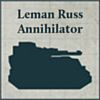

## Tallarn Reborn Carmine Ambush Tercio

**Defenders of Tallarn:** This Formation can only be included in an Army with the Loyalist Allegiance.

**Ambush Tercio:** Detachments from this Formation have the [Forward Deployment] and [Scout] special rules.

**STANDARD DETACHMENTS: 515 Points**

  

* **Leman Russ Strike Squadron**

4 Leman Russ Tanks, equipped with Vanquisher battlecannons and Hull Mounted lascannon. One model is upgraded to be a Tank Commander.

* **Leman Russ Annihilator Squadron**

4 Leman Russ Annihilators, equipped with Hull Mounted lascannon.

* **Leman Russ Executioner Squadron**

4 Leman Russ Executioners, equipped with Hull Mounted lascannon.

**EXPANDED DETACHMENTS: +100 Points**

 

* **Auxilia Aethon Heavy Sentinel Patrol**

4 Aethon Heavy Sentinels.

* **Auxilia Aethon Heavy Sentinel Patrol**

4 Aethon Heavy Sentinels.

---

## Galibed Oathsworn Thyreos Siege Breacher Company

**Despoilers of Tallarn:** This Formation can only be included in an Army with the Traitor Allegiance.

**Thyreos Doctrine:** While an Auxilia Medusa Battery or Auxilia Basilisk Battery Detachment from this Formation is within 2" of an Auxilia Stormsword Squadron from this Formation, each time a hit is scored against that Auxilia Medusa Battery or Auxilia Basilisk Battery Detachment, unless that hit was from a weapon with the [Barrage] or [Heavy Barrage] trait, you can allocate that hit to a Stormsword model from this Formation that is also visible to the firing Detachment.

**STANDARD DETACHMENTS: 550 Points**

  

* **Auxilia Stormsword Squadron**

3 Stormswords.

* **Auxilia Basilisk Battery**

4 Basilisks.

* **Auxilia Medusa Battery**

4 Medusas.

**EXPANDED DETACHMENTS: +400 Points**

 

* **Auxilia Stormsword Squadron**

3 Stormswords.

* **Auxilia Basilisk Battery**

4 Basilisks.
