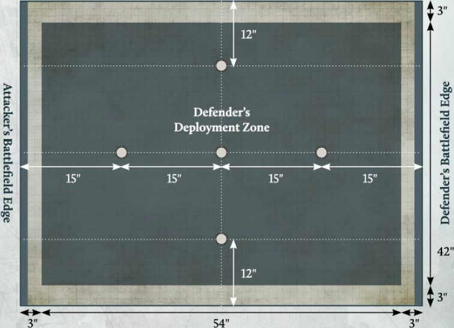
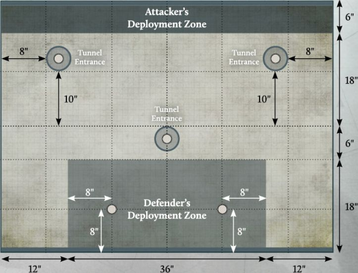
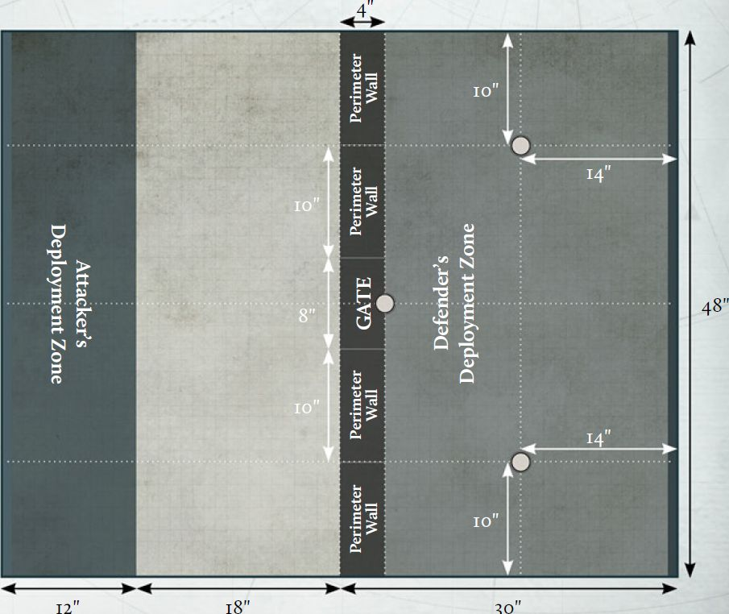

In this section you will find a series of asymmetrical Missions intended for use in a Legions Imperialis campaign. These are designed to provide interesting scenarios for your campaign, such as ambushes or assaults on static defensive positions. Because the objectives of these Missions are different for each player, you may find that the forces required to succeed are a little different to what you might use in one of the Matched Play Missions presented [in the *Legions Imperialis Rulebook*](../legions_imperialis_rules/missions.md).

For each of these Missions, one player will be designated as the Attacker, and the other will be designated as the Defender. If you are playing one of these Missions as part of a campaign, the player from the Invading Faction is the Attacker and the player from the Protecting Faction is the Defender.If you wish to play one of these Missions as a
standalone battle, players can either roll-off to determine who will be the Attacker or Defender or simply agree between themselves.

One of the most fun ways to play asymmetrical Missions outside of a campaign is to play them one way around, and then swap roles, comparing results to see which player was the most successful in each role.

### Playing these Missions

These Missions use the same Mission sequence and rules as the Matched Play Missions found [in the *Legions Imperialis Rulebook*](../legions_imperialis_rules/missions.md), unless otherwise specified in the Mission. Any changes to this process will be listed under 'Mission Specifics' for that Mission.

---

## AMBUSH

**Mission Specifics**

In this Mission, the Defender is considered to have control of the battlefield and must deploy all of their Detachments within the Defender's deployment zone (with the exception of any in Reserves). The Attacker must deploy all of their Detachments within the two Attacker's deployment zones. Each time the Attacker sets up a Formation, they may select which of their two deployment zones it is set up in, though all Detachments from the same Formation must be set up in the same deployment zone (with the exception of any in Reserves), and each deployment zone must have at least one Formation set up within it if possible.

Instead of determining Secondary Objectives as normal:

- The Attacker automatically has the Control the Battlefield Secondary Objective.

- The Defender automatically has the Defiant Secondary Objective.

**Scoring**

At the end of each round:

- The Attacker scores 3 VPs for each Uncontested Objective marker that they control. They score 5 VPs instead if that Objective is within the Defender's deployment zone.

- The Defender scores 2 VPs for each Uncontested Objective marker that they control.

At the end of the battle:

- Each player scores 3 VPs for each Uncontested Objective marker that is not within the Defender's deployment zone that they control and 5 VPs for each Uncontested Objective marker that is within the Defender's deployment zone that they control.

**Fleeing**

In this Mission, each player has two battlefield edges. When a Detachment flees, determine which of the controlling player's battlefield edges is closest to the majority of models in that Detachment. Each model in that Detachment must move towards that battlefield edge. If there is no majority, the controlling player should randomise which battlefield edge that Detachment flees towards.

---

## STRONGPOINT DEFENCE

**Mission Specifics**

In this Mission, the Defender is considered to have control of the battlefield and must deploy all of their Detachments within the two Defender's deployment zones. Each time the Defender sets up a Formation, they may select which of their two deployment zones it is set up in, though all Detachments from the same Formation must be set up in the same deployment zone (with the exception of any in Reserves), and each deployment zone must have at least one Formation set up within it if possible.

The Attacker must deploy all of their Detachments within the Attacker's deployment zone (with the exception of any in Reserves).

Instead of determining Secondary Objectives as normal:

- The Attacker automatically has the Vital Intel Secondary Objective.

- The Defender automatically has the Control the Battlefield Secondary Objective.

**Scoring**

At the end of each round:

- The Attacker scores 3 VPs for each Uncontested Objective marker that they control. If the Attacker controls both Objective markers in the Defender's Forward deployment zone, they score 5 VPs for each Uncontested Objective marker that they control instead.

- The Defender scores 2 VPs for each Uncontested Objective marker that they control. If the Defender controls both Objective markers in the Defender's Forward deployment zone, they score 3 VPs for each Uncontested Objective marker that they control instead.

At the end of the battle:

- The Attacker scores 1 VP for each Uncontested Objective marker that they control in the Defender's Forward deployment zone, 2 VPs if they control the Objective marker in neither deployment zone and 4 VPs for each Uncontested Objective marker that they control in the Defender's Rear deployment zone.

- The Defender scores 3 VPs for each Uncontested Objective marker that they control. If the Defender controls all four Objective markers in their deployment zones, they score 4 VPs for each of these instead.

---

## PLANETARY ASSAULT

**Mission Specifics**

In this Mission, the Defender is considered to have control of the battlefield and must deploy all of their Detachments within the Defender's deployment zone.

The Attacker must deploy all of their Detachments in Reserve. Detachments which cannot normally begin the battle in Reserves gain the [Outflank] special rule, unless that Detachment is an Infantry Detachment that does not have any Dedicated Transport units, in which case it gains the [Deep Strike] special rule instead.

Instead of determining Secondary Objectives as normal, both players automatically have the Control the Battlefield Secondary Objective.

**Scoring**

At the end of the second and each subsequent round:

- The Attacker scores 3 VPs for each Uncontested Objective marker that they control. They score 5 VPs instead if that Objective is the Objective at the centre of the battlefield.

- The Defender scores 2 VPs for each Uncontested Objective marker that they control.

At the end of the battle:

- Each player scores 3 VPs for each Uncontested Objective marker that they control.

---

## SEIZE THE TERMINAL

**Mission Specifics**

In this Mission, the Defender is considered to have control of the battlefield and must deploy all of their Detachments within the Defender's deployment zone (with the exception of any in Reserves). The Attacker can deploy any of their Detachments in Reserves. The remainder of their Detachments must deploy within the Attacker's deployment zone.

Instead of determining Secondary Objectives as normal:

- The Attacker automatically has the Plant the Standard Secondary Objective.

- The Defender automatically has the Collapse the Tunnels Secondary Objective (see opposite).

**Mag-rail Tunnels**

When terrain is being deployed, players should first place three Tunnel Entrance markers as shown on the deployment map. The easiest way to do this is to place three spare 5" Blast templates on the battlefield. When Objective markers are deployed, three of these will be placed on top of the Tunnel Entrance markers, at the centre of each one.

The edge of each of these Tunnel Entrance markers is treated as being an additional battlefield edge for the Attacker for the purposes of Reserves, but not for Fleeing.

**Fleeing**

In this mission, while a tunnel entrance is on the battlefield, the edge of each of these is treated as one of the Attacker's battlefield edges, as well as the marked edge of the battlefield. When a Detachment from the Attacker's Army flees, determine which of the Attacker's battlefield edges is closest to the majority of models in that Detachment. Each model in that Detachment must move towards that battlefield edge. If there is no majority, the controlling player should randomise which battlefield edge that Detachment flees towards.

***Secondary Objective***

**Collapse the Tunnels**

At the end of the Calculate Victory Points stage of each End phase, if the Defender controls any of the Objective markers that are on a Tunnel Entrance marker and that Objective marker is Uncontested, they can collapse that tunnel. If they do, remove that Tunnel Entrance marker (but not the Objective marker). That Tunnel Entrance marker is said to have been collapsed, and is no longer treated as an additional battlefield edge for the Attacker.

At the end of the battle, the player with this Secondary Objective scores 5 VPs for each Tunnel Entrance that has been collapsed.

**Scoring**

At the end of each round:

- The Attacker scores 3 VPs for each Uncontested Objective marker that they control. They score 5 VPs instead if that Objective is within the Defender's deployment zone.

- The Defender scores 2 VPs for each Uncontested Objective marker that they control.

At the end of the battle:

- Each player scores 3 VPs for each Uncontested Objective marker that is not within the Defender's deployment zone that they control and 5 VPs for each Uncontested Objective marker that is within the Defender's deployment zone that they control.

---

## BREACH THE STRONGHOLD

**Mission Specifics**

In this Mission, the Defender is considered to have control of the Battlefield and must deploy all of their Detachments within the Defender's deployment zone (with the exception of any in Reserves). The Defender can also deploy Infantry Detachments Garrisoning the Perimeter Wall Structures (as follows). The Attacker can deploy any of their Detachments in Reserves. The remainder of their Detachments must deploy within the Attacker's deployment zone.

Instead of determining Secondary Objectives as normal:

- The Attacker automatically has the Plant the Standard Secondary Objective.

- The Defender automatically has the Control the Battlefield Secondary Objective.

**The Perimeter Wall**

When terrain is being deployed, the players should also set up the Perimeter Wall on the battlefield. This is made of five Structure terrain pieces, placed side by side as shown on the deployment map opposite. The Perimeter Wall is considered to be wholly within the Defender's Deployment Zone. Four of these terrain pieces are Perimeter Walls, which should be 10" long, and one is the Gate which should be 8" long. These have the following Structure types:

| Structure Type | Armour Save (Sv) | Garrison Number (GN) | Wounds | Structure Bonus  | Cover Save |
|-----------------|------------------|----------------------|--------|-----------------------------|------------|
| Perimeter Wall | 2+  | 2   | 3 | -2 to Hit rolls   +4 CAF | 3+  |
| Gate  | 3+  | 0   | 2 | -    | -  |

At the start of each round, the player who controlled the central Objective marker at the end of the previous round (if it is the first round, the Defender can decide) can decide whether the Gate is open or closed:

- While the Gate is open, it is treated as open ground with no additional terrain rules.

- While the Gate is closed, it uses the Structure type above. If the Gate has lost any Wounds, these remain lost, even if the Gate is subsequently opened or closed. If the Gate collapses, replace it with an area of Difficult Terrain as normal. Once collapsed, the Gate can no longer be opened or closed.

Each Perimeter Wall Structure also has Wall Guns, which one Garrisoned model can fire instead of firing with weapons they are equipped with:

| Weapon | Range | Dice | To Hit | AP | Traits    |
|-----------|-------|------|--------|-----|----------------------------------|
| Wall guns | 20" | 3 | 4+ | -1 | [Light AT], [Point Defence]  |
|  | 20" | 2 | 5+ | -1 | [Anti-tank], [Point Defence], [Skyfire]|

In addition:

- Detachments from the Attacker's Army with the [Outflank] special rule cannot be deployed within the Defender's deployment zone.

- Detachments from the Attacker's Army with the [Infiltrate] special rule cannot be deployed within 12" of the Defender's deployment zone.

**Scoring**

At the end of the second and each subsequent round:

* The Attacker scores 4 VPs for each Uncontested Objective marker that they control.

* The Defender scores 2 VPs for each Uncontested Objective marker that they control.

At the end of the battle:

* Each player scores 5 VPs for each Uncontested Objective marker that they control.

