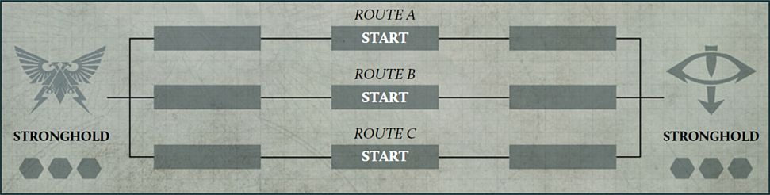
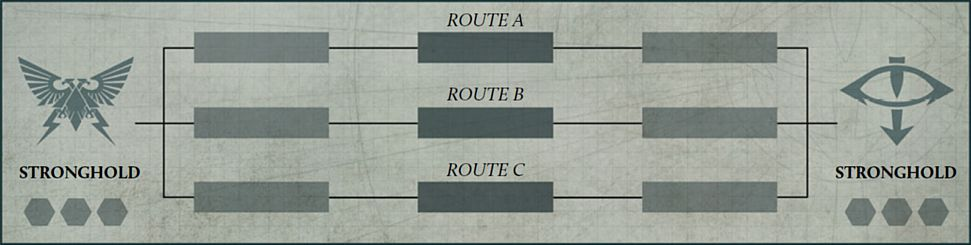
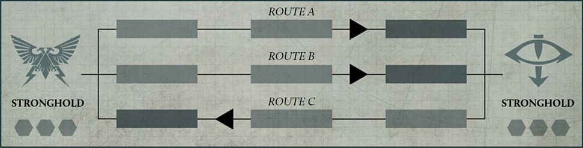
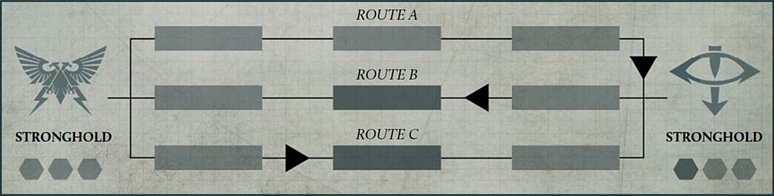

Breakthrough campaigns represent two opposing strongholds sending forces out to assault their enemy along multiple routes. Where these forces clash, a battle will be fought and one force will be pushed back until finally their stronghold will come under assault.

## Campaign Map

To play a Breakthrough campaign, the players will need a campaign map, consisting of two Strongholds and a number of 'Routes' equal to the number of players in each Faction. Each Route has three stages, each of which contains a Breakthrough marker which will move between the different stages as each Faction wins battles. Below is an example of a map for a campaign with three players in each Faction. The Campaign Master should ensure that a copy of the campaign map is available to all players to consult whenever they require.

## The Routes

At the start of the campaign, the Breakthrough marker for each Route should be on the stage marked 'Start'. At the end of each Campaign Cycle, these markers will move along their respective Route, depending on which Faction was victorious on that Route. If the Breakthrough marker moves onto a Stronghold, it cannot move any further in that direction, and if moved back towards the enemy Stronghold, will move back onto its previous Route on the first stage.

**Designer's Note: More Than Three Players**

While the example above shows a campaign map for three players, it is possible to play the Breakthrough campaign with more players. We wouldn't recommend more than five players per Faction however as this may drag the length of the campaign out significantly unless the Campaign Master declares that a Stronghold Assault can be launched with fewer Route markers on an enemy Stronghold (see [page 63]).

**Example**

At the start of a campaign, each Breakthrough marker begins in the middle stage of that Route, as shown above.

In the first Campaign Cycle, the Loyalists were victorious on Route A and Route B, and the Traitors were victorious on Route C. As such, each Breakthrough marker is moved one stage along the respective Routes towards the enemy Stronghold.

In the second Campaign Cycle, the Loyalists were victorious on Route A again, moving the Breakthrough marker onto the Traitors' Stronghold stage. The Loyalists were also victorious on Route C, while the Traitors were victorious on Route B, moving both of these Breakthrough markers back to their respective middle stages.

In the next Campaign Cycle, if the Loyalists are victorious on Route A, the Breakthrough marker will remain on the Traitor Stronghold. If the Traitors are victorious on Route A, the Breakthrough marker will move back onto the first stage of that Route.

## Faction Commander

Each Faction has a Faction Commander who oversees the war effort of their Faction. Each Faction Commander is appointed at the start of the campaign, though if players wish, the Faction Commander can change at the start of each Campaign Cycle.

## Breakthrough Campaign Sequence

The following sequence is used during each Campaign Cycle of a Breakthrough campaign:

1. Select Routes

2. Determine Battles

3. Muster Armies

4. Resolve Battles

5. Advance Breakthrough Markers

6. Cycle End Phase

### 1. Select Routes

At the start of each Campaign Cycle, in secret from the opposing Faction Leader, each Faction Leader selects a Route and assigns either themselves or one of the players from their Faction to it. Each player must be allocated to a different Route. Once all players have been assigned to a Route, the Faction Leaders reveal their selections to the opposing Faction. These selections will determine which players will fight battles in this Campaign Cycle.

### 2. Determine Battles

At this stage, the players assigned to each Route fight battles against one another. The players determine a Mission as normal, using the sequence in the *Legions Imperialis Rulebook*.

### 3. Muster Armies

Each player musters an Army, using the rules found in the *Legions Imperialis Rulebook* to a points limit of 3,000 points. When declaring an Allegiance for their Army, each player must declare the Allegiance that matches their Faction (e.g., a player from the Loyalist Faction must declare their Army Allegiance to be Loyalist).

After mustering their Army, if players have any Requisition Points, they can spend any of these to add a single additional Detachment to their Army for this battle. This does not change the agreed points limit for that battle, and so cannot affect the maximum amount of points that can be spent on Strategic Asset Formations, or the number of Formations or certain Detachments that are required to be included in an Army. That player then deducts a number of Requisition Points from their total equal to the points cost of the selected Detachment.

The additional Detachment must be included as part of a Formation, and is treated as part of that Formation for the duration of this battle, but can only be used to fill Optional Detachment slots in that Formation.

*For example, Andy has 250 Requisition Points available after mustering their Army. Their Army includes a Legion Demi-Company Formation with an unfilled Optional Battle Tank Detachment slot. Andy chooses to add a Legion Predator Squadron Detachment to that formation consisting of six models, for a total points cost of 210 points. As such they deduct 210 Requisition Points from their total.*

### 4. Resolve Battles

Players fight their battles using the Mission selected in Step 2 and the Army they have mustered in Step 3. The result of the battle must be recorded and reported to the other players and the Campaign Master.

### 5. Advance Breakthrough Markers

Once all battles have been resolved and the results reported, the Campaign Master moves the Breakthrough markers along the Routes. For each Route, the Campaign Master moves the Breakthrough marker one stage away from the Stronghold of the Faction that was victorious on that Route. If that Breakthrough marker is already on the Stronghold of the Faction that was not victorious on that Route, it does not move any further.

### 6. Cycle End Phase

During this step, each player gains Requisition Points.

- Each victorious player gains D6x15 Requisition Points.

- For each battle that was tied, both players gain D6x15 Requisition Points.

- Each player who was defeated gains D6x10 Requisition Points.

## Launching a Stronghold Assault

If at the start of a Campaign Cycle more than half of the Breakthrough markers are on the enemy Stronghold space, a Faction Commander can declare a Stronghold Assault. Instead of following the normal sequence for that Campaign Cycle, the players will play the Breach the Stronghold Mission (see [page 64](#bookmark32)). This Mission can either be fought as a team battle with all of the players taking part, or each Faction Commander can nominate a player from their Faction as their champion to fight this battle against each other. At the end of this battle, if the Attacker is victorious, the campaign ends and the Faction that was playing the Attacker in this Mission is declared the winner. If the Defender is victorious in this Mission, move each Breakthrough marker one stage towards their opponent's Stronghold, and a new Campaign Cycle begins as normal.
