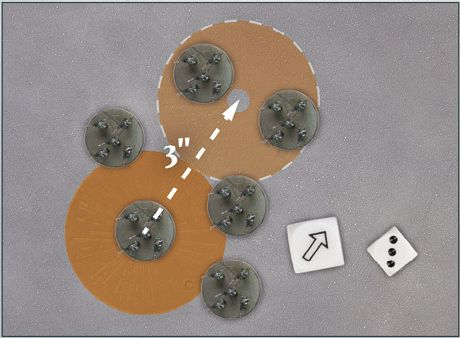
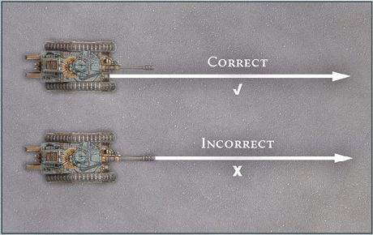
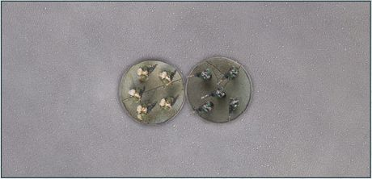
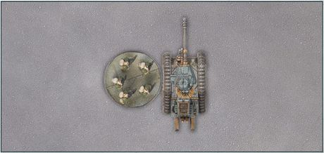
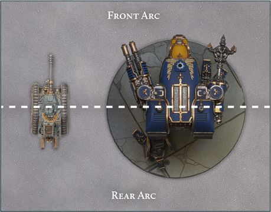
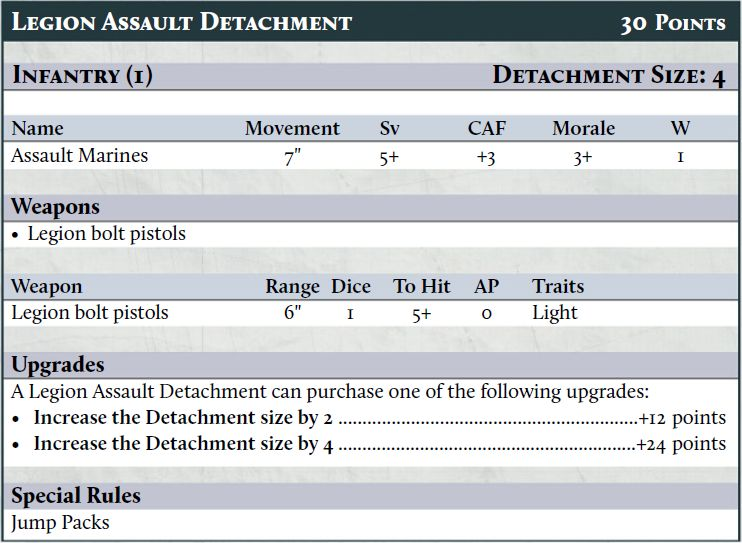

This section of the rulebook presents all of the core rules needed to play a game of Warhammer: The Horus Heresy - Legions Imperialis, from moving your armies to bringing fire and fury down upon your opponent's forces.

Whilst these rules cover most situations, certain events may arise on the tabletop that cause players some confusion. This is the '*what happens if*?' question, when a set of unforeseen circumstances occur. No rules set can cover all eventualities and if players come to an impasse, and the rulebook does not provide a clear solution, then the enjoyment of the game must come first. One way to resolve this is for players to roll a D6, with a 1-3 representing one decision and a 4-6 the other, and let the game continue.

In the end, the only rule that truly matters is that all players should have a fun and enjoyable time.

Before going further, it is worth establishing some core principles and conventions in regards to commonly used terms, dice and the game of Legions Imperialis in general. Note, the following pages introduce many terms that are explained later in greater detail - where relevant, they will include page references. If you are not yet familiar with Legions Imperialis, you may need to do a little flicking back and forth through this rulebook to get the full picture.

## Dice and Dice Rolls

**D6:** Legions Imperialis uses regular six-sided dice for nearly every roll in the game. For ease, they are referred to throughout the rules as a 'D6'. If the game requires a single dice to be rolled, the rules will say 'roll a D6', while 'roll two D6' means roll two single dice at the same time and count the results separately. Alternatively, the game might require more than one dice to be rolled and the results added together - in this instance, the rules will say 'roll 2D6', meaning roll two D6 and add the results together.

**D3:** Sometimes, the rules call for a D3 to be rolled - in this instance, an actual three-sided dice is not necessary. Instead, roll a D6 and halve the result, rounding up to the nearest whole number (i.e., a 1 or 2 counts as a 1, a 3 or 4 counts as a 2, and a 5 or 6 counts as a 3).

**Scatter Dice:** A Scatter dice is a six-sided dice that is used to determine random directions. Four of the faces show arrows while the remaining two show 'Hit' symbols, each of which features a small arrow.

**Scattering:** The term **'Scatter'** is used to refer to when an object has the potential to deviate from its current position. When a rule states to Scatter an object or model, roll the Scatter dice and the number of dice specified in the rule - usually this is D6 or 2D6. The object or model moves a number of inches equal to the result of the roll in the direction shown on the Scatter dice. If a Hit symbol is rolled, the object does not move. If instructed to Scatter even if the Hit symbol is rolled, the direction of Scatter can be determined by the small arrow.

***LIR33.1:** Scattering a template.*

### Modifying Rolls

Sometimes it will be necessary to add to or subtract from a D6 roll - for example, a rule might say to roll D6+1.

In this case, a D6 would be rolled and 1 would be added to the result. Similarly, a rule might instruct a player to halve or divide a roll. In this case, any fractions are rounded up, unless instructed otherwise. A dice can never be modified to 0 or lower, regardless of the modifier.

If multiple modifiers apply at the same time, resolve any divisions and multiplications first, then any addition or subtraction. For example, if one rule says to double the result of a D6 roll, and another rule (which also applies) says to add 1 to the result, the D6 would be rolled, the result would be doubled and 1 would be added to the total.

If a rule ever changes a result to a certain number, this overrides any modifiers unless otherwise stated. For example, if one rule said that the dice result counts as a 6, and then another (also applicable) rule said to halve the result of the roll, the result would be 6 and not 3.

### Natural Rolls

The term **'natural roll'** refers to the result of a dice roll before modifiers are applied. For example, if a rule calls for two D6 to be rolled and apply a +1 modifier, and a 1 and a 5 are rolled, the result would be a 2 and a 6, but the natural roll would still be a 1 and a 5.

**Unless instructed otherwise, when making a check on a single D6 any natural roll of a 1 is always a failure, and a natural roll of a 6 is always a success, regardless of modifiers.** It is only in rare circumstances that this does not apply. For example, when making Save rolls, the natural roll does not matter, only the end result, meaning a model with a Save characteristic of 1+ will always succeed its Save rolls, unless the characteristic is modified.

### Re-rolls

Some rules allow a player to **re-roll** a dice, while others might force players to re-roll a dice. In such instances, a re-roll is done by simply picking up the dice and rolling it again - the second result stands even if the first was preferable. A dice cannot be re-rolled more than once.

When re-rolling a roll that contains multiple dice (for example, a 2D6 roll or a three D6 roll), the player must re-roll all the dice unless it is specifically mentioned that only some of the dice can be re-rolled.

### Rolling Off

The term **'roll off'** is used when players are required to roll off dice against one another to determine the outcome of an event - the most common occurrence of this is during the Initiative phase when players roll off to see who has Initiative. To roll off, each player rolls a D6 and the highest result wins. If the result is a tie, both players roll again until one player wins, unless instructed otherwise.

### Take-backs and Changing One's Mind

It is not uncommon for players to second guess themselves occasionally by saying that they are about to do something before immediately changing their mind. As a general rule, players should be tolerant of this in their opponents as they will likely do it themselves. However, once dice are rolled for any reason, players must abide by their decision; they can no longer go back and change anything that came before the dice were rolled.

### Target Numbers

Sometimes, when making a dice roll, the rules will require you to roll a specific number followed by a '+'. This indicates that the roll is a 'target number roll'. When making a target number roll, if the result of the dice roll is equal to or greater than the number, it is a success. Otherwise, the roll is a failure. The lower the number needed, the easier it is to succeed on a target number roll.

*For example, if you are required to roll a 4+ on a single D6, a 4, 5 or 6 would be a success, but a roll of 1, 2 or 3 would not be.*

Sometimes, modifiers will be applied to a target number; for example, the Armour Penetration (AP) characteristic of a weapon applies modifiers to a model's Armour Save (Sv) characteristic, while certain special rules affect the Morale characteristic of a Detachment. In such instances, a positive modifier improves the target number (i.e., lowers the number) value while a negative modifier worsens it (i.e., increases the number).

*For example, a Detachment has a Morale characteristic of 4+. If a rule gives a +1 modifier to its Morale while making a Morale check, the Detachment's Morale characteristic becomes a 3+ for that check. Conversely, if a -2 modifier was applied to the Detachment's Morale, the 4+ would become a 6+ instead.*

If a rule states a target value is 'improved' then this is always a positive modifier.

A target number can never be improved past 1+; if the end result after multiple modifiers is 0 or below, the target number remains 1+. Unless instructed otherwise, a natural roll of a 1 is still a failure even if the target number is 1+, and a natural roll of a 6 is still a success even if the target number is a 7+ or higher.

## Tokens

In Legions Imperialis, Detachments act according to the '**Order**' issued to them at the start of each round ([see page 46](../legions_imperialis_rules/playing_the_game.md#orders-phase)). Orders are issued through the use of '**Order tokens**'. There are five kinds of Order tokens used in Legions Imperialis:

 Advance
 
 First Fire

 Charge

 Fall Back

 March

Order tokens are placed during the Order phase of each round. Once a player has chosen a Detachment's Order, they place an Order token face-down on the Detachment's Order token slot on the army roster. Alternatively, Order tokens may be placed face-down next to the Detachment. Some Detachments have restrictions as to what Order they can be issued. Where this is the case, it will be noted in the Detachment's special rules on its datasheet.

## Armies, Detachments, Models and Figures

During a game of Legions Imperialis, players will take control of a variety of models, representing the different elements of their Army. All of the models under a player's control are collectively referred to as their 'Army'.

Models are the foundation of every Legions Imperialis Army. The term '**model**' refers to a single miniature or base of figures. The vast majority of Legions Imperialis models are mounted on bases. Given the scale of the battles that Legions Imperialis represents, a base may include multiple '**figures**' (i.e., each individual Legionary or Solar Auxilia soldier), such as five Space Marines on a single base. As such, the term model is used to refer to a single base, regardless of how many figures are on that base. When models do not have bases, such as most Vehicles, the term model refers to each individual figure (e.g., each Leman Russ Tank).

If the rules ever use the term 'model', this always means a single base or miniature.

On the battlefield, models move and fight in '**Detachments**'. A Detachment contains one or more models that move, fight and stick together on the battlefield. A single Warlord Battle Titan, four Malcador Tanks or six Legionary models would all be Detachments in their own right.

### Base Size and Figure Count

In almost all circumstances, save for those that do not need bases, a Legions Imperialis miniature will be supplied with a base of the appropriate size within the box. The rules are designed with these base sizes in mind and it is presumed that players will use them. 

If, for whatever reason, a model is fielded on a base size other than the one provided with it (for example, due to a conversion), then it still counts as being on its standard-sized base for the purposes of the rules. In such instances, the controlling player must have the model's standard base size ready for use during gameplay for a point of reference.

The rules account for different numbers of figures on a base, which can change in numbering depending on the figures themselves. In general, the number of figures on a base should match those shown on Games Workshop official products and should be distributed evenly across the base; the rules have been written with this in mind. If, for whatever reason, a base includes fewer figures than normal then leeway should be given to an opponent when determining line of sight.

Due to the unique nature of Flyers, their base size is less stringent than other models, though it is advised that Flyers should be mounted on 40mm bases or on a standard Aeronautica Imperialis hex base. If a player wishes to use a different base size, they should check with their opponent before the game to make sure they are happy with it.

## Mustering an Army

A Legions Imperialis Army is made up of a number of Detachments grouped together into 'Formations', with each Detachment operating independently on the battlefield. If a rule refers to a Detachment, then all models in the relevant Detachment are affected. Similarly, if a rule refers to a Formation, all models in Detachments within that Formation are affected by it.

Players muster an Army by using an Army List of their choice, up to an agreed points limit. Each Army List has its own available Formations and Detachments from which a player can build their Army. A Detachment has a points cost associated with it and may have additional upgrades which they can take, often for an increased points cost.

A player's Army points value (i.e., the total points cost of all its Detachments) can be equal to or less than the agreed points limit, but can never exceed it.

For more information on mustering an Army, [see page 126](../legions_imperialis_rules/mustering_an_army.md).

### Friendly and Enemy

Rules terms often make reference to 'friendly models/Detachments' and 'enemy models/ Detachments'. Friendly models/Detachments are defined as any models/Detachments controlled by yourself or a player on the same team as you. Enemy models/Detachments are any models/ Detachments controlled by your opponent(s) (i.e., the people you are playing against).

If a rule states it affects models/Detachments with no qualifier if they are friendly or enemy, then it affects both friendly and enemy models/Detachments.

## Measuring Distances

In Legions Imperialis, distances are measured in inches (") using a tape measure or range ruler. Players can measure distances whenever they wish during the course of a battle.

***LIR39.1:** Measuring the Distance from one model to another.*

Distances between models, as well as between models and other battlefield features (such as terrain or objectives), are measured from the closest point of one base to the closest point of the other. If a model or object does not have a base, measure to or from the closest point of that model or object overall. Insignificant elements on a model, such as protruding weapon barrels, banners or armour spikes, are ignored when measuring distances.

***LIR39.2:** Measuring the distance from a Vehicle's hull.*

### Within and Wholly Within

The terms 'within' and 'wholly within' are sometimes used for rules that require players to measure distances. If a rule affects models or objects 'within' a certain distance, then it applies so long as any part of a model's base or part of the object is within the specified distance. If the rule refers to a Detachment, then it applies so long as any part of a single model's base from that Detachment, or part of a single model from that Detachment, is within the specified distance.

If a rule affects a model or object 'wholly within' a certain distance, then all of that model's base, or all of the model if it does not have a base, must be within the specified distance for the rule to apply. Similarly, if a rule affects a Detachment 'wholly within' a certain distance, then every part of every model's base within that Detachment, or every part of every model within that Detachment if they do not have bases, must be within the specified distance for the rule to apply.

The same principles are used for rules that refer to Formations; a single model or Detachment from a Formation must be within range when a rule uses within, while all models in a Formation must be within range if the rule uses wholly within.

## Line of Sight

Whether a model can see another model is often determined by the presence of terrain and other models. 

Terrain can take many forms but, broadly speaking, a piece of terrain is presumed to be a realistic scale representation of actual structures, ruins or other terrain features. Therefore, if a model can see part of another model, such as one of its figures or one of a Vehicle's tracks, ignoring any insignificant elements such as protruding weapons or bases, then it has line of sight to it unless a specific rule prevents this from happening - for example, an area of Obstructing terrain ([see page 68](../legions_imperialis_rules/terrain.md#obstructing-terrain)) blocks line of sight through it, so even if you personally can see a model, the model you control cannot.

If it is unclear if a model can see another model, then players can check by getting a 'model's eye view'. To do this, position yourself so you are level with the model and see what they can see. If the other model is not completely obscured by terrain or another Detachment, then the first model has line of sight to it.

When determining line of sight, ignore models that are from the same Detachment - it is presumed they manoeuvre out of the way to allow a clear shot. Other models, however, can block line of sight; for example, if you can't see an enemy Infantry model behind an enemy, or friendly, Baneblade model, then you cannot target it.

***LIR40.1:** The Iron Hands Legionaries can fire at some but not all of these potential targets. They can clearly see the Death Guard Command Detachment (A), while the Death Guard Legionaries (B) are partially hidden beyond an Obstacle but still visible; both are valid targets. Only the barrel of the Leman Russ (C) can be seen and so it is not a valid target and cannot be chosen.*

## Base to Base Contact

In Legions Imperialis, most models have bases. When a model's base is touching another model's base, that is referred to as 'base to base contact', or simply as 'base contact'. In cases where a model has no base, base to base contact refers to a part of the model touching the base of another model or, where neither model has a base, part of a model touching part of another model.

As with measuring distances and determining line of sight, protruding elements - such as weapons that extend outside of the model's main body, or large banners - are ignored when checking if a model is in base contact with another model. However, these elements do not block a model from getting into base contact - only other models can do that. If a model can reach another model, and the only thing preventing the two models from touching is a protruding weapon or other insignificant element, the models are classed as being in base contact.

***LIR41.1:** Examples of base to base contact (top) and base to base contact where one miniature has no base (bottom).*

## Arcs

Most weapons can be fired in any direction, and for the majority of Detachments it does not matter which direction the firing model is facing. However, for some types of models such as Vehicles, Knights and Titans, the direction they are facing is important both to determine which Detachments they can target when making an attack and to determine if an attack against them is striking a more vulnerable area.

To facilitate this, every model in Legions Imperialis has two 180° 'Arcs' - a 'Front Arc' and a 'Rear Arc' - that are determined by an imaginary line cutting through the centre of the model's base, or the centre of the model if it does not have a base.

***LIR42.1:** Front arcs of a Leman Russ (left) and a Warhound Titan (right).*

The Front Arc encompasses the front of the model and the Rear Arc encompasses the rear of the model. For most models, the front of the model is clear, however there may be some ambiguous cases. In such instances, agree with your opponent before the game starts as to what is the front of such models.

Certain weapons can only target models within the Front or Rear Arc of the attacking model - where this is the case it will be listed in the weapon's Traits as Arc (Front) or Arc (Rear). If neither Trait is listed, the weapon can target any eligible model within either Arc. An enemy model outside of the specified Arc of the firing model cannot be chosen as a target, and counts as being out of line of sight for that weapon.

For some models, such as Vehicles, the direction an attack is coming from can have pronounced effects - if this is the case, it will be described in its rules. Where facing is relevant, the centre of a Detachment's Front Arc determines the direction a model is facing.

## The Battlefield 

All games are played on a 'battlefield'. The exact size and nature of the battlefield is up to the players, however the standard game of Legions Imperialis uses a 5' x 4' battlefield. The battlefield represents the boundaries of the battle the players are fighting - models cannot move off the battlefield except in special circumstances.

## Datasheets

On the battlefield, each model is represented by a characteristics profile, which details their capabilities in battle. A model's profile can be found in their respective 'datasheet'. The Army Lists section of this book ([see page 126](../legions_imperialis_rules/mustering_an_army.md)) presents a number of datasheets for Detachments which you can field on the battlefield; future supplements will add to this. A datasheet shows the characteristics of each model within the Detachment alongside any special rules that affect them and upgrade options available to the Detachment. The datasheet for a Legion Assault Detachment is shown below as an example:

**Detachment Name**

The name of the Detachment. If a rule refers to a Detachment by name, the rule applies to all models within that Detachment, even if the Detachment includes different models, such as a Contemptor Dreadnought and a Leviathan Siege Dreadnought.

**Points Cost**

The base points cost of a Detachment - all models within the Detachment size are included in the points cost of the Detachment. See Mustering an Army on [page 126](../legions_imperialis_rules/mustering_an_army.md) for more details.

**Detachment Type**

A 'Detachment type' is a keyword that is used to reflect how certain rules affect the Detachment, such as how the Detachment interacts with terrain ([see page 66](../legions_imperialis_rules/terrain.md) for more on terrain). Detachment types are accompanied by a number in brackets - this is the Scale ([see page 45](../legions_imperialis_rules/core_principles.md#model-scale)) of each model within that Detachment.

**Detachment Size**

The base number of individual models that make up the Detachment.

**Name**

The name of each model in the Detachment; upgrades may add models with different names.

**Movement**

The distance, in inches, that the model can move ([see page 49](../legions_imperialis_rules/playing_the_game.md#movement-phase) for more details).

**Armour Save (Sv)**

How protected a model is from incoming enemy fire. The Armour Save characteristic is a target number and can be used when a model makes a Save roll. Armour Save is a type of Save characteristic; a Detachment can gain additional Save characteristics through special rules ([see page 57](../legions_imperialis_rules/playing_the_game.md#multiple-save-characteristics) for more details).

**Close Assault Factor (CAF)**

How skilled a model is in close combat - see Combat [on page 60](../legions_imperialis_rules/playing_the_game.md#combat) for more details.

**Morale**

A measure of a model's resolve. Morale is a target number and is used when making Morale checks - [see page 63](../legions_imperialis_rules/playing_the_game.md#morale) for more details.

**Wounds**

When a model fails a Save roll after taking a Hit, it suffers a Wound (see Firing [on page 56](../legions_imperialis_rules/playing_the_game.md#firing)) and it reduces its Wounds characteristic by 1. If it is ever reduced to 0, the model is destroyed and removed from the battlefield.

**Weapons**

The weapons each model in the Detachment has are listed here. Some models have a choice of weapons, which is chosen by the controlling player when assembling an Army. Models within a Detachment can be armed differently from one another, allowing players to mix and match weapons within a Detachment, unless it is stated that '*All models in the Detachment must have the same weapons*'. Some Detachments will have the option of replacing weapons with other weapons, usually at an additional points cost - for more information, see Mustering an Army [on page 126](../legions_imperialis_rules/mustering_an_army.md).

**Weapon Name**

The name of the weapon.

**Range**

The maximum range, in inches, that the weapon can fire. Sometimes this will be given as two values - where that is the case, the target must be at least a number of inches away from the firing model equal to the lowest range shown and no more than the highest range shown.

**Dice Value**

The number of D6 rolled when firing the weapon.

**To Hit**

How accurate and likely to damage the target the weapon is. The To Hit value is a target number and is used when making Hit rolls.

**Armour Penetration (AP)**

How effective the weapon is at punching through armour. This is almost always either 0 or a negative modifier. When a firing model scores a Hit with a weapon, the AP value of that weapon is applied to the target's Armour Save characteristic when making Save rolls against that Hit.

**Traits**

Some weapons have Traits, which are special rules that apply to those weapons. The rules for each Trait will be listed either [on page 77](../legions_imperialis_rules/weapon_traits.md) or in the respective supplement.

**Upgrades**

Some Detachments have optional upgrades which they can purchase. Each upgrade will have a points cost associated with it, which increases the total points cost of the Detachment by the specified amount. If an upgrade states '*all models in the Detachment can...*' then all models of the particular name specified, or all models if no particular model is specified, in the Detachment are affected by the upgrade. Otherwise, models are upgraded individually.

If an upgrade increases the Detachment size, then the added models are the same as the Detachment's base models unless specified. Added models have the weapons listed on the datasheet, with the controlling player choosing any weapon options as normal. Some Detachment size upgrades add different models. Where these models have different characteristics, special rules and/or weapon options the datasheet will include an additional profile to cover this. All upgraded models use the stated profile, which can lead to Detachments containing models with different characteristics. Though they have different characteristics, all models still function as part of the same Detachment.

**Special Rules**

Some models are affected by additional rules that represent their extraordinary abilities. The exact effects of a special rule can be found in the Special Rules section of this book ([see page 86](../legions_imperialis_rules/special_rules.md)) or in the relevant supplement.

## Model Scale

A Legions Imperialis Army includes models of all shapes and sizes. To represent this, each Detachment type has a 'Scale' associated with it, which applies to all models in the Detachment. In some instances, a model's Scale will determine how it can act upon the battlefield; for example, if two opposing Detachments with the same Scale are in base contact, neither can move until one of them withdraws or is destroyed. However, if a Detachment of Infantry is in base to base contact with a Titan, the latter can easily ignore the swarming masses beneath it.

A model's Scale can be found on its datasheet, in brackets next to its Detachment type.