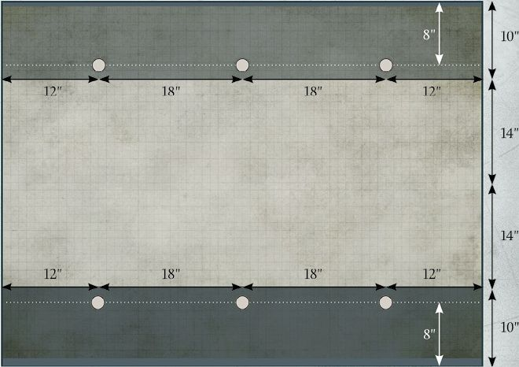
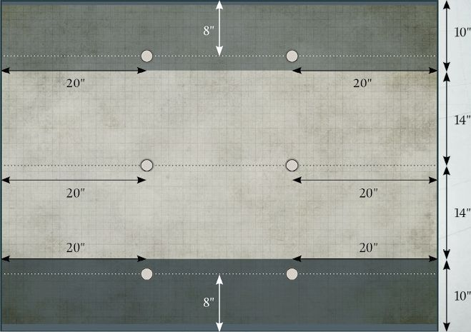
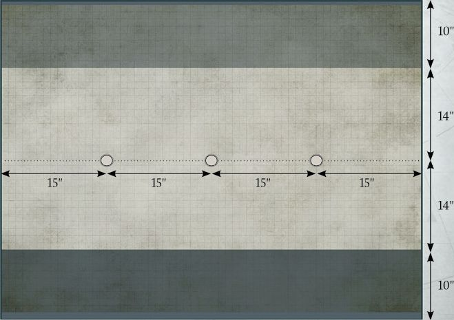
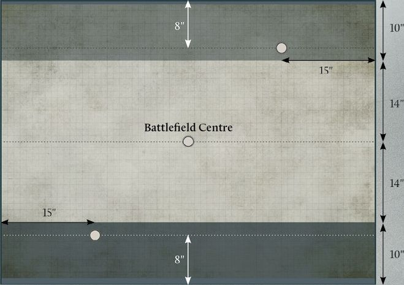
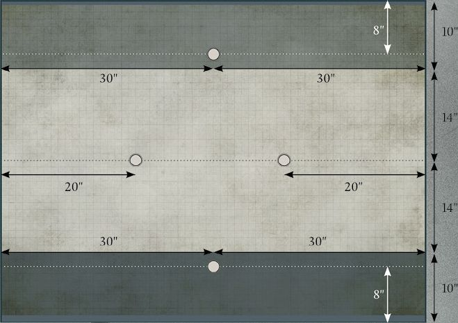
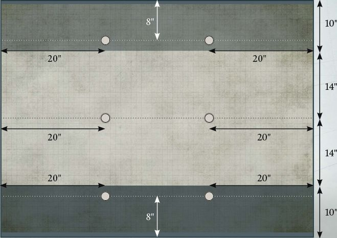
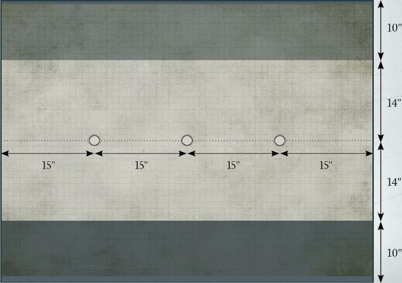
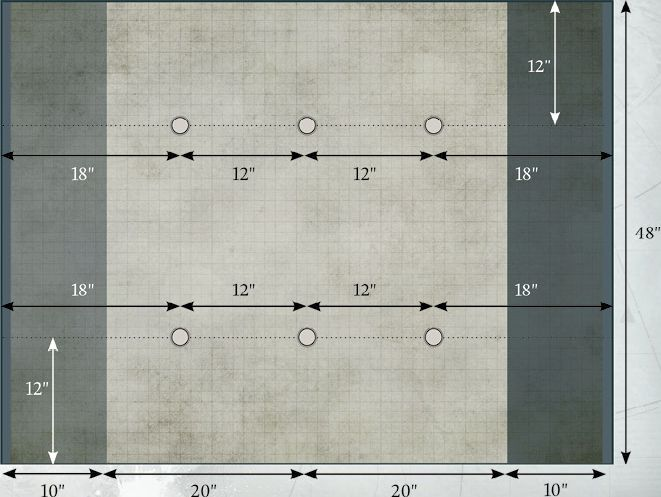
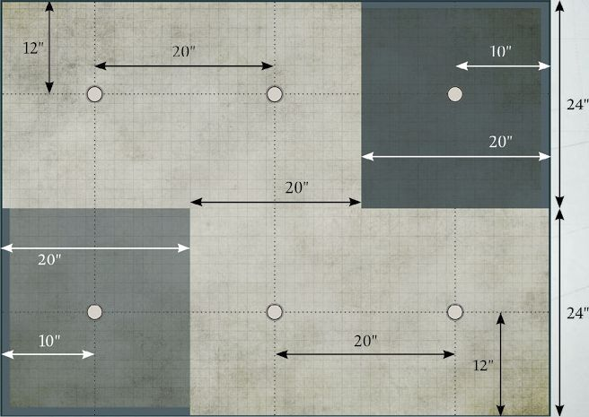

The following pages list the Matched Play Missions. Each Mission comprises a deployment map and the conditions for winning a battle.

After terrain has been set up, the player who wins control of the battlefield chooses a deployment zone. Deployment zones are indicated on each Mission's deployment map, represented by different colours for each zone. In the majority of Missions presented here, a player's battlefield edge is the long table edge which is touching the player's deployment zone - where this is not the case, the battlefield edge of each player will be highlighted in a corresponding colour. Any Objective markers that need to be deployed are represented by black dots.

Some Missions will have additional rules for deployment or special rules that are active during the battle. These will be listed in the Mission's description.

## CONFRONTATION

**Scoring**

At the end of each round, you score:

* 3 VPs for each Uncontested Objective marker in your deployment zone that you control.

* 7 VPs for each Uncontested Objective marker in your opponent's deployment zone that you control.

## SEIZE AND HOLD

**Scoring**

At the end of each round, you score:

* 2 VPs for each Uncontested Objective marker in your deployment zone that you control.

* 5 VPs for each Uncontested neutral Objective marker you control.

* 7 VPs for each Uncontested Objective marker in your opponent's deployment zone that you control.

## NO MAN'S LAND

**Scoring**

At the end of each round, you score:

* 3 VPs if you control a single Uncontested Objective marker.

* 7 VPs if you control two Uncontested Objective markers.

* 11 VPs if you control three Uncontested Objective markers.

## HOLD GROUND

**Scoring**

At the end of each round, you score:

* 2 VPs if you control the Objective marker in your deployment zone and it is Uncontested.

* 5 VPs if you control the Objective marker in your opponent's deployment zone and it is Uncontested.

* 9 VPs if you control the Objective marker in the centre of the battlefield and it is Uncontested.

## STRONGHOLD ASSAULT

**Scoring**

At the end of each round, you score:

* 4 VPs for each Uncontested neutral Objective marker you control.

* 9 VPs if you control the Objective marker in your opponent's deployment zone and it is Uncontested.

At the end of the battle, you score:

* 7 VPs if you control the Objective marker in your deployment zone and it is Uncontested.

## DEVASTATION

**Scoring**

At the end of each round, you score:

* 5 VPs for each Uncontested Objective marker in your deployment zone that you control.

* 3 VPs for each Uncontested neutral Objective marker you control.

**Special Rule:**

**Tactics of Devastation**

At the end of each round, if a player controls an Objective marker in their opponent's deployment zone, they destroy it. If they do so, remove the Objective marker from the battlefield - it no longer plays any part in the battle. In addition, the player that destroyed it immediately gains 10 VPs.

## FLANKING ACTION

**Scoring**

At the end of each round, you score:

* 2 VPs if you control the Objective marker in your deployment zone and it is Uncontested.

* 4 VPs for each Uncontested neutral Objective marker you control; if you control two or more Uncontested neutral Objective markers, you gain 6 VPs for each one you control instead.

* 8 VPs if you control the Objective marker in your opponent's deployment zone and it is Uncontested.

## RETRIEVAL

**Scoring**

At the end of each round, you score:

* 5 VPs for each Uncontested Objective marker you control.

**Special Rule:**

**Protect the Intel**

At the end of each round, after Victory Points have been scored, if a player controls one or more Uncontested Objective markers, they can move them - if both players control Uncontested Objective markers, the player with the Initiative moves their markers first.

Each Objective marker can move a maximum of 5" in any direction. The Objective marker cannot move through enemy models, cannot end its movement overlapping its base with any other model, a Structure or an area of Impassable terrain, and cannot move off the battlefield.

## FORWARD PUSH

**Scoring**

The further an Objective marker is from a player's battlefield edge, the greater the number of VPs it is worth to that player.

At the end of each round, you score:

* 3 VPs for each Uncontested Objective marker that you control that is 18" away from your battlefield edge.

* 5 VPs for each Uncontested Objective marker that you control that is 30" away from your battlefield edge.

* 9 VPs for each Uncontested Objective marker that you control that is 42" away from your battlefield edge.

## CONQUEST

**Scoring**

At the end of each round, you score:

* 4 VPs for each Uncontested Objective marker you control.

* An additional 5 VPs if you control at least three Uncontested Objective markers; if one of those markers is within your opponent's deployment zone, you score an additional 9 VPs instead.

## ALL OUT WAR

**Objective Makers**

Once both players have chosen their deployment zones, they take it in turns, starting with the player with control of the battlefield, to deploy an Objective marker until both players have deployed three Objective markers.

Players can deploy Objective markers anywhere in their deployment zone more than 8" from any battlefield edge and more than 10" from a previously deployed Objective marker.

**Deployment**

During the deployment step, all models must be deployed at least 8" away from any previously deployed enemy models. Detachments with the Infiltrate special rule can be deployed in the opposing player's deployment zone but must still be placed at least 4" from enemy models.

**Scoring**

At the end of each round, you score:

* 3 VPs for each Uncontested Objective marker in your deployment zone that you control.

* 7 VPs for each Uncontested Objective marker in your opponent's deployment zone that you control.

## POINT ASSAULT

**Deployment**

During the deployment step, all models must be deployed at least 3" away from any previously deployed enemy models.

**Scoring**

At the end of each round, you score:

* 2 VPs if you control the Objective marker in your deployment zone and it is Uncontested.

* 7 VPs if you control the Objective marker in your opponent's deployment zone and it is Uncontested.

* 4 VPs each for any Uncontested neutral Objective marker you control; the Objective marker in the centre of the battlefield is counted as a neutral Objective. If you control two or more Uncontested neutral Objective markers, and one of these is the Objective in the centre of the battlefield, you gain an additional 4 VPs.

