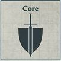

This Quick Start guide will help you get started with your first games of Legions Imperialis, and presents a new Formation, Mission and Optional Special Rules designed to work directly with the contents of the Legions Imperialis boxed game, adjusting a typical game of Legions Imperialis to more easily make use of smaller armies. The *Warhammer: The Horus Heresy - Legions Imperialis Rulebook* is required to use this content.

***Designer's Note:** This guide is designed as an introduction to the game of Legions Imperialis by splitting the contents of a single Legions Imperialis boxed game into two separate armies, each army containing both Legiones Astartes and Solar Auxilia models. It is intended to be used in conjunction with the Opening Manoeuvres Mission on page 2. The battlefield size of this mission is smaller than an average Legions Imperialis game - adding additional Detachments may require adjustment to the battlefield size, and the placement of Objectives, accordingly.*

**New Formation**

Below is presented a new Formation for the Legiones Astartes Army List, intended to let you more easily use the contents of the Legions Imperialis boxed game with the Opening Manoeuvres Mission. Unless your opponent agrees, this Formation cannot be used in Matched Play games, nor is it intended for use at events.

'Legion' Detachments must be selected from the Legiones Astartes Army List, and 'Solar Auxilia' Detachments must be selected from the Solar Auxilia Army List, as described in the *Legions Imperialis Rulebook*.

---

## Legion Astranii Class Augmented Spearhead

The Space Marine Legions had a long history of inducting Solar Auxilia Cohorts into their ranks, whether purpose-raised from a Legion's fief or absorbed after years of enduring service. These 'Legiones Auxilia' Cohorts fought alongside the Legions across myriad theatres, with augmented spearheads merging Legion and Auxiliary assets into a single cohesive tactical force.

**Inducted Cohorts:** All Legion HQ Detachments within this formation gain the [Solar Auxilia HQ] (10") Special Rule.

**Subordinate:** Detachments and models selected from the Solar Auxilia Army List as part of this Formation do not count as [Legion Name] Detachments or models and do not gain any additional special rules associated with any Legion.

**COMPULSORY DETACHMENTS**

**Legion**

  

**Solar Auxilia**

  

**OPTIONAL DETACHMENTS**

**Legion**

**Solar Auxilia**

---

## OPENING MANOEUVRES

**Scoring**

At the end of each round, you score:

- 1 VP for each Uncontested Objective marker that you control.

At the end of the battle, you score:

- 2 VPs for each Uncontested Objective marker that you control.

**Optional Special Rules**

**Scout Titans** - For this Mission, Army Lists may include a Legion Support Strategic Asset Formation consisting of a single Warhound Hunting Pack Detachment ignoring the 30% points limit restriction on Formations and Detachments not selected from the Army's Primary Army List. Both players must agree before the game for this Special Rule to be used.

**To The Death!** - During this Mission, Formations do not become Broken. Both players must agree before the game for this Special Rule to be used.

---