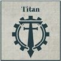
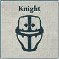

## Legion Support

**COMPULSORY DETACHMENTS**

---

## Knight Household Lance

**Paragon of Duty:** Each Knight Scion is a master of battle, trained in the tactics of their Household. As such, each Knight model within this Formation that has the [Independent] special rule always forms its own Independent Unit, even if there are several models within a Detachment that have the same name.

*For example: A Questoris Knight Banner consists of a Knight Errant, 2 Knight Paladin and 1 Questoris Knight Armiger Talon. As such the Detachment is formed of three Independent Units: a Knight Errant, a Knight Paladin and a Knight Paladin.*

In some cases, this will mean the entire Detachment is formed of Independent Units - they still count as a single Detachment, and so must maintain a Coherency of 6" with at least one other model in the Detachment, but otherwise can be issued an Order separately, have some models Engaged and not others, etc.

**COMPULSORY DETACHMENTS**

