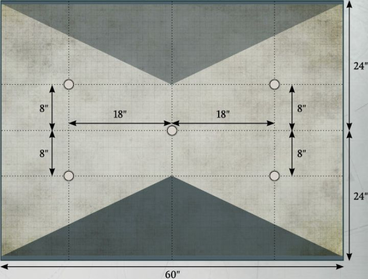

The following pages list a set of Missions intended solely for use with the Titandeath rules presented in this section. Each Mission comprises a deployment map and the conditions for winning the battle.

The Missions presented in this book assume a battlefield size of 5\'x4\', and all deployment maps are written with this in mind. However, players are free to agree amongst themselves the battlefield size, adjusting deployment zones and Objective marker placement as needed.

Deployment zones are indicated on each Mission's deployment map, represented by different colours for each zone. In the Missions presented here, the battlefield edge of each player is highlighted in a corresponding colour. The position of any Objective markers that are required in that Mission is represented on the deployment map by black dots.

Some Missions will have additional rules for deployment or special rules that are active during the battle.

These will be listed in the Mission's description.

## DOMINATION

**Scoring**

At the end of each round, each player scores:

-   3 VPs for each Uncontested     Objective marker that     player controls.

At the end of the battle, each player scores:

-   5 VPs for each Uncontested     Objective marker that     player controls.

---

## BREAKTHROUGH

**Scoring**

At the end of each round, each player scores:

-   2 VPs for each Uncontested     Objective marker in their     deployment zone that they control.

-   4 VPs for each Uncontested     Objective marker in neither     player's deployment zone that     they control.

-   8 VPs for each Uncontested     Objective marker in their     opponent's deployment zone that     they control.

---

## POINT OF CONFLICT

**Scoring**

At the end of each round, each player scores:

-   3 VPs for each Uncontested     Objective marker that     player controls.

-   5 VPs if that player controls     the central Uncontested     Objective marker.

